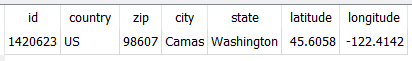

## Zipcodes

Original code found here: https://github.com/vangheem/pyzipcode

## Data Files

https://drive.google.com/drive/folders/100YGJZ9_djFcXcBjtQjAsyQCU6DRbjx5?usp=sharing

## Nexus

Command: `!set trade <city> <zip> <country code>` 

>  `SELECT * FROM ZipCodes WHERE city LIKE '%Camas%' AND zip = 98607 AND country = 'US'`



Save to Nexus profiles `zip_id` from `id` returned above (1420623)

Command: `!trade 10km`

```python
zcdb = ZipCodeDatabase()
in_radius = list(z.id for z in zcdb.get_zipcodes_by_zip_id(1420623, 10))
print(in_radius)
# [1411988, 1411989, 1411990, 1411991, 1412016, 1412019, 1420622, 1420623]
```

Now query Nexus profiles for matching `zip_id`

> `SELECT * FROM Profiles WHERE zip_id IN (1411988, 1411989, 1411990, 1411991, 1412016, 1412019, 1420622, 1420623)`

Returns list of IGN similar to raid invites within 10km if user based on current server, and have option to include separate list of FC that can be copied